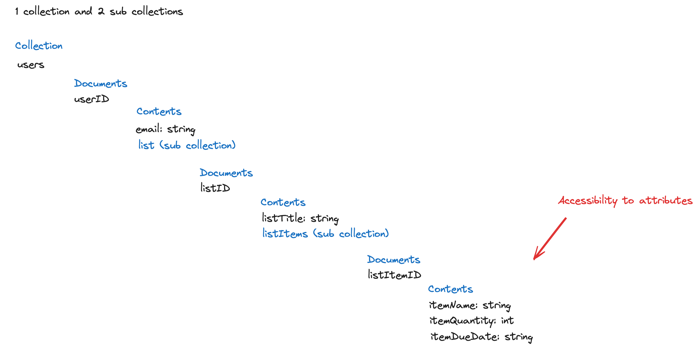

# Minimal Viable Product Proposal

## By Julian Rocha and Amna Tasneem

A Minimum Viable Product (MVP) is a version of the product that a team provides customers with in each iteration of delivery. It has enough functionality to be able to observe their behavior with it - characterized by as little effort as possible. This allows the team to receive valuable feedback while also making sure they don’t develop what is not needed.

The MVP we propose to be delivered at the end of Sprint 4 for our project “CoShop” will include user authentication, a single list with CRUD functionalities, and the ability to add attributes to list items. We have already been able to implement user authentication and UI screens for both the authentication and the user’s list.

For the first step we have leveraged Google’s Firebase and implemented email and password authentication. Here is a trivial breakdown of our authentication flow:

**Registration:** after a user registers a new account with us, we create a user document inside of our users collection where we store their email and create a new empty list for them. If everything goes successfully, we redirect them to their list screen where they are guided to add their first list item.

**Login:** after a user logs in to their existing account, we redirect them to their list screen where we render all of their list information, including list name and list items.

In the future we are considering creating additional fields to a user document such as their name, profile image, and demographics so that we can better understand our users and customize their experience with CoShop. We also have plans to allow users to create more than one list so for that we plan on creating an empty array of lists for each user on registration rather than limiting them to one list. Eventually our goal is to also allow them to share any of their lists with friends and family who have been introduced to CoShop.

An important aspect of implementing user authentication for us will be to keep track of the auth state of a user. We would want to make sure that list content is displayed only to the right user and only when they are logged in, otherwise they should only see a login/registration page. This would of course mean that we would also be creating both a sign up and sign in page for our product that takes care of their respective logic. Thankfully, we have investigated a UI library that has great looking components right out of the box for use. We will be leveraging this library to save precious time on UI until we eventually switch to Tailwind CSS to create custom components that match our Figma prototype.

When it comes time to develop user lists, we plan on creating a subcollection for each user that holds their list. Each list will have a list name and a subcollection of list items each able to hold attributes such as quantity, due date, etc.

This data modeling approach leverages Firebase’s subcollection abilities, simplifies our development process by not having to constantly create document references, and allows for efficient querying of data.
