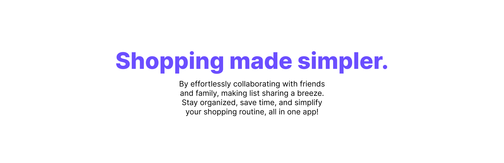

<p align="center">
  <br/>
  <a href="https://app.shopwithcoshop.com">CoShop</a> is a web app designed to make shopping simpler by effortlessly collaborating with friends and family, making list sharing a breeze. Stay organized, save time, and simplify your shopping routine, all in app!
  <br/><br/>
</p>

## Project Documentation

Learn more about the CoShoppers team [here](./TEAM.md).

Read about our development process [here](./PROCESS.md).

Read about our CI/CD philosophy [here](./CICD.md).

Read about our MVP proposal [here](./MVP.md).

Read about our definition of done [here](./DONE.md).

Read about what technologies we use to build CoShop Web [here](./TECHNOLOGIES.md).

## Table of Contents

1. [Getting Started](#getting-started)
   - [Prerequisites](#prerequisites)
   - [Installation](#installation)
2. [Usage](#usage)
   - [Configuration](#configuration)
   - [Running the Website](#running-the-website)
3. [Contributing](#contributing)
   - [Code Formatting](#code-formatting)
   - [Branching Strategy](#branching-strategy)
   - [Workflow Example](#workflow-example)
4. [License](#license)
5. [Contact](#contact)

## Getting Started

### Prerequisites

Before setting up the project, ensure that you have the following prerequisites installed on your system:

- [Node.js](https://nodejs.org/): Make sure you have Node.js installed.
- [npm](https://www.npmjs.com/): npm is the package manager for JavaScript. You can install it by installing Node.js.

### Installation

[Step 1: Clone the repository]

```bash
git clone https://github.com/thecoshopteam/coshop-web.git
```

[Step 2: Install dependencies]

```bash
cd coshop-web
npm install # (or i for short)
```

## Usage

### Configuration

Before running the website, you'll need to perform the following configuration steps:

1. Create a `.env` file in the root of the project.

2. Paste the received variables into the `.env` file.

#### Running the Website

```bash
# Start the local development server
npm run dev
```

### Contributing

#### Code Formatting

We use a pre-commit hook to handle code formatting using Husky. This ensures consistent and clean code. Before making a commit, the pre-commit hook will run automatically.

#### Branching Strategy

1. Main Branch (`main`):

   - Represents the stable and latest production-ready code.
   - Code from `staging` is merged into "main" after thorough testing and validation.

2. Staging Branch (`staging`):

   - Serves as a staging environment for pre-release testing.
   - Code from `development` is merged into `staging` for broader testing and verification before reaching the main branch.
   - This branch is configured with a [custom URL](https://staging.app.shopwithcoshop.com/).

3. Development Branch (`development`):

   - Acts as an integration branch where `feature` branches and `bug fix` branches are merged to ensure they work well together.
   - Provides a stable environment for ongoing development.
   - Allows for continuous integration and testing of features and bug fixes.

4. Feature Branches (`feature/your-feature`):

   - Created from `development` for developing new features.
   - Isolated work on a specific feature or enhancement.
   - Merged back into `development` after completion and testing.

5. Bug Fix Branches (`bug-fix/your-bug-fix`):
   - Created from `development` for addressing bugs or issues.
   - Isolated work on a specific bug fix.
     -Merged back into `development` after completion and testing.

#### Workflow Example

1. Create a new branch for your feature or bug fix:

   ```bash
   # Feature example
   git checkout -b feature/your-feature dev

   # Bug fix example
   git checkout -b bug-fix/your-bug-fix dev
   ```

2. Make your changes, test them thoroughly locally, and then commit your changes to your feature branch:

   ```bash
   # Feature example
   git add .
   git commit -m "Description of your feature"
   git push origin feature/your-feature

   # Bug fix example
   git add .
   git commit -m "Description of your bug fix"
   git push origin bug-fix/your-bug-fix
   ```
   
3. For additional testing, merge your `feature` branch into the `staging` branch.

4. Test your changes in the staging environment with the [custom URL](https://staging.app.shopwithcoshop.com/).

5. If everything tests correctly in the staging site, create a pull request from `staging` to `main` on GitHub.

6. After final review and approval from your lead, they will merge your changes into the `main` branch for production releases!

By following this workflow, we ensure that we maintain a stable `main` branch for our visitors, utilize `feature` and `bug fix` branches for an isolated environment, and conduct pre-production testing on the `staging` branch before releasing our excited new changes.

### License

This project is proprietary to CoShop. All rights reserved.

For more details, please refer to the [License](./LICENSE.md).

### Contact

For internal inquiries and collaboration within the team, please contact:

- Julian: [julian@shopwithcoshop.com](mailto:julian@shopwithcoshop.com)
- Amna: [amna@shopwithcoshop.com](mailto:amna@shopwithcoshop.com)
